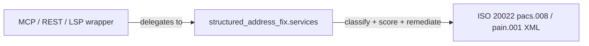

# structured-address-fix: ISO 20022 Structured-Address Remediation

[![PyPI Version][pypi-badge]][pypi-url]
[![Python Versions][python-versions-badge]][pypi-url]
[![License][license-badge]][01]
[![Tests][tests-badge]][tests-url]
[![Quality][quality-badge]][quality-url]
[![OpenSSF Scorecard][scorecard-badge]][scorecard-url]
[![Documentation][docs-badge]][docs-url]

**A vendor-neutral core library that detects, scores, and remediates
non-compliant postal addresses in [ISO 20022][iso] payment messages** —
ahead of the **14 November 2026** cliff, when fully unstructured addresses
are rejected across SWIFT CBPR+, HVPS+, T2 RTGS, CHAPS, Fedwire, and Lynx.
Point it at a `pacs.008` or `pain.001` document, get back an explainable
list of findings, and turn an `AdrLine`-only address into a structured one
with reversible, auditable patches.

> **The cliff, in one line.** From **14 November 2026** an ISO 20022 postal
> address that is `AdrLine`-only (unstructured) is non-compliant and liable
> to be rejected by the major cross-border and high-value schemes. A
> *hybrid* address (town + country plus at most two residual `AdrLine`
> lines) is the minimum bar; *structured* is the target. This library exists
> to move addresses across that line before it bites.

## Contents

- [Overview](#overview)
- [The ISO 20022 Suite](#the-iso-20022-suite)
- [Install](#install)
- [Quick Start](#quick-start)
- [Architecture](#architecture)
- [Policies](#policies)
- [Premium rule packs](#premium-rule-packs)
- [Writing a rule pack](#writing-a-rule-pack)
- [When not to use structured-address-fix](#when-not-to-use-structured-address-fix)
- [Development](#development)
- [Security](#security)
- [Documentation](#documentation)
- [License](#license)
- [Contributing](#contributing)
- [Acknowledgements](#acknowledgements)

## Overview

`structured-address-fix` is the shared core of a small ISO 20022 address
toolchain. It reads the postal addresses carried by the parties of a payment
message (debtor, creditor, agents, ultimate parties), classifies each one as
**structured**, **hybrid**, or **unstructured** per CBPR+ UG2026, scores the
compliance risk against a chosen policy, and — where it can — proposes a
remediation that promotes the address toward the structured target.

Two properties are non-negotiable:

- **Explainable.** Every remediation is a set of RFC 6902-shaped
  `PatchOperation`s. Each records *why* it exists (the `FindingCode` it
  resolves), *where its value came from* (the originating `AdrLine` token,
  when applicable), and *how confident* the deriving heuristic was. Anything
  it cannot resolve is reported as a **residual finding**, so the gap to full
  compliance is always visible.
- **Safe by default.** Untrusted XML is parsed with `defusedxml` (no XXE,
  no billion-laughs). The canonical address model is frozen, closed to extra
  fields, and enforces the ISO 20022 element-length maxima as construction
  invariants. Errors raise a typed [`StructuredAddressError`](docs/error-taxonomy.md)
  with a stable `code` and safe `context`.

- **Website / docs:** <https://sebastienrousseau.github.io/structured-address-fix/>
- **Source code:** <https://github.com/sebastienrousseau/structured-address-fix>
- **Bug reports:** <https://github.com/sebastienrousseau/structured-address-fix/issues>

The public surface is the `structured_address_fix.services` facade; the
domain models are re-exported from the package root for convenience.

## The ISO 20022 Suite

`structured-address-fix` is the **postal-address remediation core** of the
sebastienrousseau ISO 20022 suite. It supersedes and generalises the bespoke
`pacs008.standards.address` module, and it is the shared engine that a thin
Model Context Protocol server wraps for AI agents — so the classification and
remediation logic lives in exactly one place and every surface behaves
identically.

| Package | Role |
| :--- | :--- |
| **`structured-address-fix`** | **The core library (this package): domain model, policies, adapters, services facade, plugin SDK** |
| [`structured-address-fix-mcp`](https://github.com/sebastienrousseau/structured-address-fix-mcp) | Thin Model Context Protocol server wrapping the services facade for AI agents |
| [`pacs008`](https://github.com/sebastienrousseau/pacs008) | FI-to-FI credit-transfer library; delegates its address linting + Nov-2026 readiness here |



## Install

`structured-address-fix` runs on macOS, Linux, and Windows and requires
**Python 3.12+** and **pip**. Its only runtime dependencies are `pydantic`,
`defusedxml`, and `xmlschema`.

```sh
python -m pip install structured-address-fix
```

<details>
<summary>Using an isolated virtual environment (recommended)</summary>

```sh
python -m venv venv
source venv/bin/activate        # macOS/Linux
venv\Scripts\activate           # Windows
python -m pip install -U structured-address-fix
```
</details>

## Quick Start

For the guided tour, see [`docs/quickstart.md`](docs/quickstart.md).

### Classify an address

The domain model is re-exported from the package root and works standalone.
`CanonicalAddress` models the ISO 20022 `PostalAddress27` type and classifies
itself per CBPR+ UG2026:

```python
from structured_address_fix import CanonicalAddress

# Unstructured: AdrLine only, no town / country -> rejected from the cliff.
unstructured = CanonicalAddress(
    address_lines=("221B Baker Street", "London NW1 6XE", "United Kingdom"),
)
print(unstructured.classification)   # AddressClassification.UNSTRUCTURED

# Structured: town + country + structured detail, no residual AdrLine.
structured = CanonicalAddress(
    building_number="221B",
    street_name="Baker Street",
    post_code="NW1 6XE",
    town_name="London",
    country="GB",
)
print(structured.classification)     # AddressClassification.STRUCTURED

# Serialise back to ISO 20022 element names for the wire.
structured.model_dump(by_alias=True, exclude_none=True)
# {'BldgNb': '221B', 'StrtNm': 'Baker Street', 'PstCd': 'NW1 6XE',
#  'TwnNm': 'London', 'Ctry': 'GB', ...}
```

### Assess and remediate a message

The top-level entry point is the `structured_address_fix.services` facade:
`assess` returns a read-only [`ValidationReport`](docs/remediation-model.md);
`remediate` adds the proposed fixes (and, optionally, the patched XML):

```python
from structured_address_fix.services import assess, remediate

pacs008_xml = ...  # an ISO 20022 pacs.008 document, as text

# 1. Score every party's address against a policy.
report = assess(pacs008_xml, policy="cbpr-2026")
print(report.is_compliant)                       # False
for finding in report.findings:
    print(finding.code, finding.party_role, finding.message)
# SAF001 Dbtr  Address is AdrLine-only; rejected from 2026-11-14

# 2. Propose reversible, explainable patches for what can be fixed.
result = remediate(pacs008_xml, policy="cbpr-2026")
for suggestion in result.suggestions:
    print(suggestion.before.classification, "->",
          suggestion.after.classification)       # unstructured -> hybrid
    for op in suggestion.operations:
        print(op.op, op.path, op.reason_code, op.confidence)
    # Anything no heuristic could resolve is reported, never hidden:
    for residual in suggestion.residual_findings:
        print("residual:", residual.code)
```

> The built-in policies, XML adapters, per-country heuristics, and the
> `assess` / `remediate` facade land in the v0.0.x series; see
> [`ROADMAP.md`](ROADMAP.md). The domain model and error taxonomy shipped in
> v0.0.1 and are stable.

## Architecture

The library is layered so that each concern is testable in isolation and the
public surface stays small. Dependencies point downward only.

| Layer | Module | Responsibility |
| :--- | :--- | :--- |
| **Domain** | `structured_address_fix.domain` | Pure Pydantic v2 entities and their invariants, with zero I/O: `CanonicalAddress`, `AddressedParty`, `RiskFinding`, `PatchOperation`, the result envelopes, and the wire-facing enums. |
| **Policies** | `structured_address_fix.policies` | Rulebooks that inspect a `CanonicalAddress` and raise `RiskFinding`s: the four built-ins (see below), each citing a rulebook clause. |
| **Adapters** | `structured_address_fix.adapters` | `defusedxml` parsing of pacs.008 / pain.001, party discovery, and the per-country `AdrLine` → structured heuristics that populate the canonical model with recorded confidence + source tokens. |
| **Services** | `structured_address_fix.services` | The `assess` / `remediate` facade — the single public entry point wrappers (MCP / REST / LSP) call. |
| **Plugins** | `structured_address_fix.plugins` | The premium rule-pack SDK: entry-point discovery of third-party `PolicyPack`s, gated by entitlement + integrity checks. |

## Policies

A **policy** is a rulebook: it names the finding codes that apply and the
severity each carries. Four are built in and open-source:

| Policy id | Scope | Use it when |
| :--- | :--- | :--- |
| `cbpr-2026` | SWIFT CBPR+ UG2026 cross-border requirements — the Nov-2026 cliff rules. **The default.** | You send or receive cross-border SWIFT payments |
| `sepa` | SEPA credit-transfer address expectations | You operate in the euro retail-payment area |
| `hvps-plus` | HVPS+ high-value / RTGS market-practice (T2, CHAPS, Fedwire, Lynx) | You settle over a high-value system |
| `generic-structured` | Scheme-agnostic structured-vs-unstructured hygiene | You want the baseline structural checks with no scheme assumptions |

The default policy is `cbpr-2026`, overridable per call or via the
`SAF_DEFAULT_POLICY` environment variable. Finding codes (`SAF001`–`SAF008`)
are a stable public API: a code's meaning is fixed once released. See
[`docs/policies.md`](docs/policies.md) for the full rule-to-code mapping and
[`docs/error-taxonomy.md`](docs/error-taxonomy.md) for the exception codes.

## Premium rule packs

The four built-in policies cover the open, published scheme rules. Some
requirements — proprietary market-practice profiles, correspondent-specific
overlays, jurisdiction-specific address validation — are better shipped as
**premium rule packs**: separately installable Python distributions that
register additional policies through an entry point.

A pack is discovered automatically once installed, contributes its own policy
ids and finding codes (with their own prefixes, so they never collide with the
core `SAF` codes), and is gated at load time by the entitlement + integrity
checks in the [error taxonomy](docs/error-taxonomy.md)
(`PackNotLicensedError`, `PackIntegrityError`). The core never bundles a pack;
you opt in by installing one.

```python
from structured_address_fix.services import assess

# A premium pack's policy id, resolved through the plugin registry.
report = assess(message_xml, policy="acme-correspondent-2026")
```

## Writing a rule pack

Publishing a rule pack means shipping a `PolicyPack` and advertising it under
the `structured_address_fix.policies` entry-point group:

```toml
# pyproject.toml of your pack distribution
[project.entry-points."structured_address_fix.policies"]
acme-correspondent-2026 = "acme_saf_pack:PACK"
```

```python
# acme_saf_pack/__init__.py
from structured_address_fix.domain import (
    FindingCode, RiskFinding, Severity, CanonicalAddress,
)

def check(address: CanonicalAddress, *, location: str) -> list[RiskFinding]:
    """Raise the pack's findings against a single address."""
    findings: list[RiskFinding] = []
    if address.post_code is None:
        findings.append(RiskFinding(
            code=FindingCode.MISSING_TOWN,  # or a pack-specific code
            severity=Severity.ERROR,
            message="Correspondent profile requires a post code.",
            policy_id="acme-correspondent-2026",
            location=location,
        ))
    return findings

PACK = ...  # a PolicyPack binding the id "acme-correspondent-2026" to check()
```

The full contract — the `PolicyPack` shape, custom finding-code prefixes,
entitlement, and integrity signing — is in
[`docs/writing-a-rule-pack.md`](docs/writing-a-rule-pack.md).

## When not to use structured-address-fix

- **Your addresses are already fully structured.** If every message you send
  already carries `TwnNm` + `Ctry` + structured detail and no `AdrLine`,
  there is nothing to remediate; a one-off `assess` to confirm compliance is
  all you need.
- **You need to *generate* whole payment messages.** This library remediates
  the postal-address portion of an existing message; it does not build a
  pacs.008 or pain.001 from scratch. Use the message-family libraries for
  that (e.g. `pacs008`, `pain001`).
- **You want an agent tool, not a library import.** Use the thin
  [`structured-address-fix-mcp`](https://github.com/sebastienrousseau/structured-address-fix-mcp)
  server, which wraps this facade for MCP clients.
- **You need authoritative address verification against a postal database.**
  The `AdrLine` → structured heuristics are deterministic, explainable
  best-effort splits with recorded confidence; they do not consult a national
  address file. Low-confidence or unresolvable fragments are reported as
  residual findings for a human to resolve, never silently guessed.
- **You need a schema validator.** For pure XSD validation of a whole
  document, use `xmlschema` directly; this library focuses on address
  compliance, not full-message schema conformance.

## Development

`structured-address-fix` uses [Poetry](https://python-poetry.org/) and
[mise](https://mise.jdx.dev/).

```bash
git clone https://github.com/sebastienrousseau/structured-address-fix.git && cd structured-address-fix
mise install
poetry install
poetry shell
```

A `Makefile` orchestrates the quality gates (kept in lockstep with CI):

```bash
make check        # lint + type-check + test (REQUIRED before commit)
make test         # pytest at 100% line + branch coverage
make lint         # ruff + black --check
make type-check   # mypy --strict
make security     # bandit
make examples     # run each examples/*.py
make pip-compile  # regenerate hash-pinned requirements/*.txt from *.in
```

## Security

Untrusted ISO 20022 XML is parsed with `defusedxml`, never the standard-library
parser, so XXE / billion-laughs / external-DTD attacks are structurally
prevented. The canonical model is frozen and `extra="forbid"`, and every error
is a typed `StructuredAddressError` with a stable `code` and safe `context`, so
a wrapping transport can serialise `{"error": ...}` payloads rather than leaking
tracebacks. Premium rule packs are opt-in and gated by entitlement + integrity
checks. Reporting practice, supported versions, the NIST SSDF practice mapping,
and the accepted OpenSSF Scorecard findings are documented in
[`SECURITY.md`](SECURITY.md). Vulnerabilities go via GitHub Private
Vulnerability Reporting, not public issues.

## Documentation

- [`README.md`](README.md) — this file
- [`docs/index.md`](docs/index.md) — documentation index
- [`docs/quickstart.md`](docs/quickstart.md) — guided tour
- [`docs/policies.md`](docs/policies.md) — the built-in policies and their rules
- [`docs/writing-a-rule-pack.md`](docs/writing-a-rule-pack.md) — the premium rule-pack contract
- [`docs/remediation-model.md`](docs/remediation-model.md) — findings, patches, and results
- [`docs/error-taxonomy.md`](docs/error-taxonomy.md) — the exception codes
- [`docs/nov-2026-cutover.md`](docs/nov-2026-cutover.md) — the Nov-2026 cliff, scheme by scheme
- [`CHANGELOG.md`](CHANGELOG.md) — release notes
- [`SECURITY.md`](SECURITY.md) — disclosure + supported versions
- [`ROADMAP.md`](ROADMAP.md) — where the project is going

## License

Licensed under the [Apache License, Version 2.0][01]. Any contribution submitted
for inclusion shall be licensed as above, without additional terms.

## Contributing

Contributions are welcome — see the [contributing instructions][04]. Thanks to
all [contributors][05].

## Acknowledgements

Built on [Pydantic](https://docs.pydantic.dev/), [defusedxml][defusedxml], and
[xmlschema](https://github.com/sissaschool/xmlschema), and grounded in the
ISO 20022 CBPR+ / HVPS+ structured-address requirements.

[01]: https://opensource.org/license/apache-2-0/
[04]: https://github.com/sebastienrousseau/structured-address-fix/blob/main/CONTRIBUTING.md
[05]: https://github.com/sebastienrousseau/structured-address-fix/graphs/contributors
[iso]: https://www.iso20022.org
[defusedxml]: https://github.com/tiran/defusedxml
[docs-badge]: https://img.shields.io/badge/Docs-structured--address--fix-blue?style=for-the-badge
[docs-url]: https://sebastienrousseau.github.io/structured-address-fix/
[license-badge]: https://img.shields.io/pypi/l/structured-address-fix?style=for-the-badge
[pypi-badge]: https://img.shields.io/pypi/v/structured-address-fix?style=for-the-badge
[pypi-url]: https://pypi.org/project/structured-address-fix/
[python-versions-badge]: https://img.shields.io/pypi/pyversions/structured-address-fix.svg?style=for-the-badge
[quality-badge]: https://img.shields.io/github/actions/workflow/status/sebastienrousseau/structured-address-fix/ci.yml?branch=main&label=Quality&style=for-the-badge
[quality-url]: https://github.com/sebastienrousseau/structured-address-fix/actions/workflows/ci.yml
[scorecard-badge]: https://api.scorecard.dev/projects/github.com/sebastienrousseau/structured-address-fix/badge?style=for-the-badge
[scorecard-url]: https://scorecard.dev/viewer/?uri=github.com/sebastienrousseau/structured-address-fix
[tests-badge]: https://img.shields.io/github/actions/workflow/status/sebastienrousseau/structured-address-fix/ci.yml?branch=main&label=Tests&style=for-the-badge
[tests-url]: https://github.com/sebastienrousseau/structured-address-fix/actions/workflows/ci.yml
